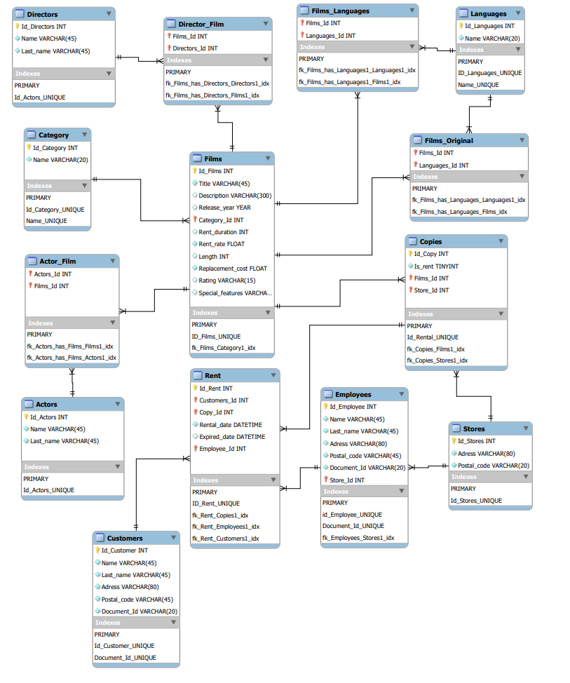

# IRONHACK_MySQL

<div style="text-align:center">
    
</div>

## Indice:
1.[✍️ Descripción](#descripcion)\
2.[🗒️ Premisas](#premisas)\
3.[💾 Database](#database)\
4.[📁 Estructura](#Estructura)


## Descripción:<a name="descripcion"/>


Segundo proyecto en Ironhack consistente en la creción de una base de datos. Partimos de unos archivos .csv, que formaban parte de la base de datos de un antiguo video-club, a partir de ellos construiremos una nueva base de datos estableciendo las relaciones correctas entre entidades.

## Premisas:<a name="premisas"/>

A la hora de crear la base de datos seguiremos las siguientes pautas:

* intentaremos conservar la mayor parte de los datos que se consideren de utilidad, aunque estos estén incompletos. Será una labor futura el decidir si se pueden actualizar estos datos con la información faltante, o eliminar dicha información

- Se crearán nuevas tablas en la DB que se consideren necesarias para el nuevo modelo de negocio, aunque no se posea información antigua para completarla, Pero si serán necesarias para la entrada completa y correcta de nuevos registros.

- Consideramos que una película puede tener uno o más idiomas (tanto original como el de la copia)

- Una película solo puede tener una categoría

- Una película puede tener muchas copias, pero una copia sólo puede estar en una tienda

- Un empleado sólo puede estar asociado a una tienda

- Un alquiler sólo puede ser creado por un empleado

- Crearemos una tabla de directores aunque esta esté vacía

## Database: <a name="database"/>

El esquema de la base de datos es el siguiente:

<div style="text-align:center">
    
</div>

## Estructura:<a name="Estructura"/>

```
root 
|__ data/                           
|   |__ clean/          # Archivos .csv resultantes del proceso de limpieza
|   |__ raw/            # Archivos .csv de donde partimos 
|
|__ images/             # Contiene la imágenes que se han usado en el proyecto   
|
|__ jupyter/            # Contiene Clean_and_upload.ipynb donde se puede ver todo el proceso de construcción de la base de datos
|   |__ src/            # Contiene video_func.py (archivo de funciones usadas en la cración de la base de datos)
|
|__ SQL/                # Contiene los archivos necesarios para crear la base de datos
|
|__ .gitignore          # Archivo gitignore     
|
|__ README.md           # Descripción del proyecto
|
|__ requirements.txt    # Versiones de las librerías usadas en el proyecto

```
